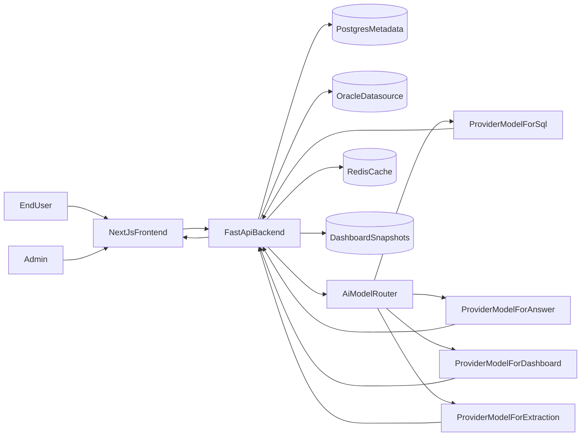

# Smart BI MVP Implementation Plan

## Goal

Deliver an internal-usable MVP where:

- Admin connects Oracle and defines semantic knowledge (tables, relationships, dictionary, metrics).
- End users ask business questions and receive answer text + result table + executable SQL.
- End users create and edit dashboards through chatbot prompts and persist dashboards for later viewing.
- AI layer can route different tasks to different LLM providers/models (for example, one model for SQL generation and another for user-facing narrative response).

## Proposed Architecture

## System Modules

- **Frontend (Next.js)**
  - Admin console: Oracle connection setup, schema/relationship/dictionary/metric management.
  - User chat workspace: ask question, view answer/SQL/table, save to dashboard.
  - Dashboard workspace: list/open/edit dashboards via natural language prompts.
- **Backend (FastAPI)**
  - Auth + RBAC (admin/user).
  - Oracle connectivity service + schema introspection.
  - Semantic layer service (business dictionary, relationships, metric formulas).
  - AI orchestration layer (provider registry, task-based model routing, fallback chain, prompt templates, cost/latency tracking).
  - NL2SQL orchestration pipeline with guardrails and SQL validation.
  - Dashboard generation/edit service (prompt -> dashboard JSON spec).
- **Data Stores**
  - Postgres for app metadata (users, connections, semantic layer, chat history, dashboards).
  - Oracle for business data querying.
  - Redis for cache/session/job state (optional but recommended in MVP).

## Delivery Phases

1. **Documentation-first discovery and design (must complete before coding)**
  - Create product documentation set:
    - Vision, scope, and success metrics for MVP.
    - Full user experience roadmap (admin and end-user journeys, core flows, edge cases).
    - UX design package (information architecture, wireframes, interaction specs, dashboard builder UX patterns).
    - Technical roadmap (milestones, dependencies, delivery timeline).
    - Technical design (component architecture, data model, API contracts, AI orchestration design, deployment topology).
    - System security design (authN/authZ, secret management, encryption at rest/in transit, SQL safety, audit logging, threat model).
  - Review and sign-off gate: no implementation until docs above are approved.
2. **Project bootstrap and foundations**
  - Create monorepo skeleton with:
    - `[/Users/phucnm/Documents/git/smart-bi/apps/web]( /Users/phucnm/Documents/git/smart-bi/apps/web )`
    - `[/Users/phucnm/Documents/git/smart-bi/apps/api]( /Users/phucnm/Documents/git/smart-bi/apps/api )`
    - `[/Users/phucnm/Documents/git/smart-bi/packages/shared]( /Users/phucnm/Documents/git/smart-bi/packages/shared )`
  - Set up Docker Compose for Postgres, Redis, and local dev dependencies.
  - Implement JWT auth and role model (`admin`, `user`).
3. **Admin Oracle connection + metadata ingestion**
  - Build secure connection profile CRUD (host, port, service/SID, username, encrypted password).
  - Add Oracle test-connection endpoint.
  - Build schema introspection job (tables, columns, PK/FK) and persist into metadata DB.
4. **Semantic knowledge management (admin)**
  - CRUD for:
    - table descriptions
    - relationship overrides
    - business dictionary terms
    - metric definitions (name, formula, grain, dimensions)
  - Version semantic definitions to support safe iteration.
5. **AI layer: multi-provider and multi-model orchestration**
  - Implement provider abstraction and credential management for multiple LLM vendors.
  - Implement task-to-model routing policy, for example:
    - SQL generation and SQL repair -> model profile `sql_gen`.
    - User-facing natural language explanation -> model profile `answer_gen`.
    - Dashboard spec generation/edit -> model profile `dashboard_gen`.
    - Entity/metric extraction and query classification -> model profile `extract_classify`.
  - Add fallback and retry policy across providers/models by task.
  - Add model governance config in metadata DB (`provider`, `model`, `temperature`, `max_tokens`, `timeout`, `cost_limit` per task).
6. **Business question answering (user)**
  - Chat endpoint pipeline:
    - intent + context retrieval from semantic layer
    - SQL generation (Oracle dialect, routed by AI task profile)
    - SQL safety checks (read-only, schema allowlist)
    - result interpretation and user narrative (routed by AI task profile)
    - execution + result formatting
  - Response contract includes: `answer`, `sql`, `columns`, `rows`, `confidence`, `warnings`.
  - Frontend displays: natural-language answer, data table, and expandable SQL.
7. **Dashboard creation via chat**
  - Convert user prompt + query results into dashboard spec JSON (widgets, chart types, filters, layout).
  - Save dashboard + version history.
  - Dashboard listing and detail pages.
8. **Dashboard editing via AI**
  - Prompt-based patching of existing dashboard specs.
  - Preview before save and version rollback.
  - Audit trail for AI changes.
9. **MVP hardening and acceptance**
  - Add basic observability (request logging, job status, error tracking).
  - Add AI observability (token/cost/latency per task profile and per provider).
  - Add seed/demo Oracle metadata and end-to-end test scenarios for all 5 user stories.
  - Define release checklist and runbook.

## API Surface (MVP)`POST /auth/login`

- `GET/POST /admin/connections`
- `POST /admin/connections/{id}/test`
- `POST /admin/connections/{id}/introspect`
- `GET/POST/PUT /admin/semantic/tables`
- 

- `GET/POST/PUT /admin/semantic/relationships`
- `GET/POST/PUT /admin/semantic/dictionary`
- `GET/POST/PUT /admin/semantic/metrics`
- `GET/POST/PUT /admin/ai-routing/profiles`
- `POST /admin/ai-routing/validate`
- `POST /chat/questions`
- `POST /dashboards`
- `GET /dashboards`
- `GET /dashboards/{id}`
- `POST /dashboards/{id}/ai-edit`
- `GET /dashboards/{id}/versions`

## Key Risks and Mitigations

- Oracle SQL generation drift -> strict SQL validator + schema/column allowlist.
- Hallucinated metrics/joins -> semantic retrieval + confidence + explicit warnings.
- Model/provider outage -> task-based fallback chain and provider health checks.
- Cross-model inconsistency (SQL vs narrative) -> reconciliation step using result-grounded answer generation.
- Slow queries -> row limits, async jobs for heavy workloads, caching hot queries.
- Unsafe prompt edits on dashboards -> JSON schema validation + preview + rollback.

## Acceptance Criteria by User Story

- Admin can connect Oracle and pass test query.
- Admin can define/update semantic knowledge for tables, relationships, dictionary, and metrics.
- User question returns answer text, SQL, and data table in one response.
- User can create dashboard from chatbot prompt and re-open later.
- User can modify an existing dashboard via chatbot and save a new version.
- Admin can configure different providers/models per AI task profile and changes take effect without redeploy.
- Documentation set (UX roadmap, UX design, technical roadmap, technical design, security design) is approved before implementation starts.

