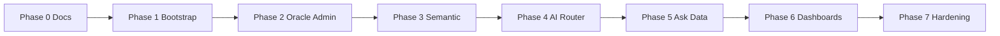

# Smart BI Technical Roadmap

This roadmap orders engineering work from documentation through MVP hardening. It pairs with [User Experience](./02-ux-roadmap.md) milestones and [Solution Architecture](./solution-architecture.md).

**Status legend:** **[Done]** = meets phase intent for current repo · **[Partial]** = scaffolding, stubs, or dev-only · **[To do]** = not started or not meeting phase goals

| Phase | Summary status |
|-------|----------------|
| 0 | **[Done]** |
| 1 | **[Partial]** — web + API + Compose; auth not production-grade |
| 2 | **[Partial]** — **real** test + introspect (Oracle / PostgreSQL / MySQL); JSON persistence (not Postgres) |
| 3 | **[Partial]** — semantic CRUD + **JSON** persistence; **no** versioning |
| 4 | **[Partial]** — profiles + catalog + **JSON** persistence; **`run_task`** uses **real HTTPS** when per-provider API keys exist (**simulated** when missing) |
| 5 | **[Partial]** — contract + UI; **NL2SQL pipeline** with `connection_id` when LLM keys set; **sqlglot** policy + heuristic fallback |
| 6 | **[Partial]** — **JSON file** dashboards + versions; **LLM `dashboard_gen`** + parse fallback; AI edit via full-spec LLM |
| 7 | **[Partial]** — pytest API tests + Playwright smoke; metrics/runbook TBD |

## Milestone overview

## Phase 0 - Documentation and Design Gate
- **[Done]** Finalize product, UX, technical, and security documents.
- **[To do]** Obtain stakeholder approval before coding (process; outside repo).

## Phase 1 - Platform Bootstrap
- **[Done]** Monorepo with Next.js app and FastAPI service.
- **[Done]** Postgres + Redis via Docker Compose.
- **[Done]** Shared contracts package (`packages/shared`).
- **[Partial]** JWT auth and RBAC — dev `POST /auth/login` only; **no** enforced JWT on routers, **no** Postgres-backed users.

## Phase 2 - Data Admin Capabilities
- **[Done]** Connection profile CRUD with **file-backed** list (`connection_store` → `apps/api/data/connections.json`).
- **[Done]** Connectivity test — **real** `SELECT 1` (or Oracle `FROM DUAL`) via SQLAlchemy for **oracle / postgresql / mysql**.
- **[Done]** Schema introspection — **real** `information_schema` / Oracle `user_tab_columns` query; in-memory **per-connection cache** for chat (`db_engine` cache).
- **[To do]** Persist connections and introspection results in **Postgres**; PK/FK-rich metadata model as originally specified.

## Phase 3 - Semantic Layer
- **[Done]** CRUD for tables, relationships, dictionary, metrics with **file-backed** bundle (`semantic_store` → `semantic.json`).
- **[To do]** Versioning for semantic definitions; validation beyond `name`/`description`.

## Phase 4 - AI Orchestration
- **[Partial]** Task routing reads **persisted** profiles; `GET /admin/ai-routing/catalog` exposes allowlisted providers/models (`ai_routing_catalog.py`).
- **[Partial]** Real LLM HTTP calls via **`llm_client`** + **`httpx`** when env API keys are set; otherwise `run_task` remains **simulated**.
- **[To do]** Retry and fallback strategy; latency/cost tracking beyond basic `execution_ms` on Ask responses.

## Phase 5 - Ask Data
- **[Partial]** Semantic context for NL2SQL — **`semantic.json`** is injected into the **`sql_gen`** prompt together with introspected physical schema (not yet joined to a separate retrieval/RAG service).
- **[Partial]** **`connection_id` required** for Ask: primary flow **`nl2sql_pipeline`** (LLM SQL → **sqlglot** policy → execute); **heuristic** `preview_for_question` / `preview_select` as fallback; **`evidence`** distinguishes LLM vs fallback.
- **[Partial]** Narrative — **`answer_gen`** LLM when configured; else template text for heuristic fallback rows.
- **[Done]** Unified response payload for frontend (`AskPageClient`) including `evidence` and `meta.sql_live` / `meta.answer_live`.

## Phase 6 - Dashboard AI
- **[Partial]** Generate dashboard spec — **`dashboard_gen`** LLM with strict JSON contract + parse fallback; optional **`connection_id`** loads physical schema via introspection when needed (not only cached hints) so widgets can include **`sql`** (`dashboard_ai` service).
- **[Partial]** Save dashboard and versions — **`dashboard_store`** atomic JSON (`dashboards` + `versions` map); **no** Postgres metadata store yet.
- **[Partial]** AI edit — full-spec LLM pass (not blind widget append) + version bump persisted to JSON; **no** rich diff / rollback UX.

## Phase 7 - Hardening
- **[Partial]** API tests — `apps/api/tests/test_api.py` (`pytest`; optional JSON report).
- **[Partial]** E2E smoke — Playwright `apps/web/e2e/app.spec.js` (home, login, admin tabs, ask, dashboards list); extend for full five-story coverage.
- **[Partial]** Logging — request logging middleware present.
- **[To do]** Metrics and release runbook to production standard.

## Dependencies and critical path

- **Phases 2–3** (Oracle + semantic) block reliable **Phase 5** (context for NL2SQL).
- **Phase 4** (AI router) should be in place before production-grade **Phase 5–6** (multi-model routing and fallbacks).
- **Phase 7** runs in parallel once core flows exist; acceptance scenarios in [06-acceptance-scenarios.md](./06-acceptance-scenarios.md) define exit checks.

## Post-MVP themes (backlog)

- Additional datasource types beyond Oracle / PostgreSQL / MySQL (unified semantic abstractions).
- Row-level security and enterprise IAM integration.
- Async long-running queries and notifications.
- Cost dashboards and quota enforcement per team.
- Expanded automated evaluation for SQL quality and dashboard specs.

## Related documents

| Topic | Document |
|-------|----------|
| UX sequencing | [User Experience](./02-ux-roadmap.md) |
| Architecture | [Solution Architecture](./solution-architecture.md) |
| APIs and data | [Technical Design](./04-technical-design.md) |
| Security | [Security Design](./05-security-design.md) |
