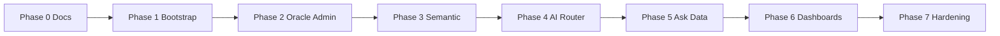

# Smart BI Technical Roadmap

This roadmap orders engineering work from documentation through MVP hardening. It pairs with [User Experience](./02-ux-roadmap.md) milestones and [Solution Architecture](./solution-architecture.md).

**Status legend:** **[Done]** = meets phase intent for current repo · **[Partial]** = scaffolding, stubs, or dev-only · **[To do]** = not started or not meeting phase goals

| Phase | Summary status |
|-------|----------------|
| 0 | **[Done]** |
| 1 | **[Partial]** |
| 2 | **[Partial]** |
| 3 | **[Partial]** |
| 4 | **[Partial]** |
| 5 | **[Partial]** |
| 6 | **[Partial]** |
| 7 | **[Partial]** |

## Milestone overview

## Phase 0 - Documentation and Design Gate
- **[Done]** Finalize product, UX, technical, and security documents.
- **[To do]** Obtain stakeholder approval before coding (process; outside repo).

## Phase 1 - Platform Bootstrap
- **[Done]** Monorepo with Next.js app and FastAPI service.
- **[Done]** Postgres + Redis via Docker Compose.
- **[Done]** Shared contracts package (`packages/shared`).
- **[Partial]** JWT auth and RBAC — dev `POST /auth/login` only; **no** enforced JWT on routers, **no** Postgres-backed users.

## Phase 2 - Data Admin Capabilities
- **[Partial]** Oracle connection profile management — in-memory list; **not** persisted to Postgres.
- **[Partial]** Connectivity test endpoint — stub success response; **not** real Oracle connectivity.
- **[Partial]** Schema introspection pipeline — stub payload; **not** real introspection job or PK/FK sync.

## Phase 3 - Semantic Layer
- **[Partial]** CRUD for table descriptions, relationships, dictionary terms, metrics — in-memory; **not** durable semantic store.
- **[To do]** Versioning for semantic definitions (as specified for production MVP).

## Phase 4 - AI Orchestration
- **[Partial]** Provider abstraction — task routing reads profiles; **no** real LLM/SDK calls (`run_task` simulated).
- **[Partial]** Task-based routing profiles — admin API holds profiles in memory.
- **[To do]** Retry and fallback strategy (beyond profile fields).
- **[To do]** Latency/cost tracking.

## Phase 5 - Ask Data
- **[To do]** Retrieval of semantic context for NL2SQL.
- **[Partial]** SQL generation, SQL safety validation, execution — **hardcoded** SQL/rows; **no** parser/allowlist/Oracle execution path as designed.
- **[Partial]** Result-grounded narrative — simulated `answer_gen` output.
- **[Done]** Unified response payload shape for frontend rendering (contract-oriented).

## Phase 6 - Dashboard AI
- **[Partial]** Generate dashboard spec — simplified fixed spec + simulated `dashboard_gen`.
- **[Partial]** Save dashboard and versions — in-memory only.
- **[Partial]** AI edit with patch + preview + rollback — simplified merge; **no** full patch/diff UX contract.

## Phase 7 - Hardening
- **[Partial]** Unit and integration tests — API tests exist (`pytest`); expand coverage.
- **[To do]** E2E happy paths for 5 user stories.
- **[Partial]** Logging — request logging middleware present.
- **[To do]** Metrics and release runbook to production standard.

## Dependencies and critical path

- **Phases 2–3** (Oracle + semantic) block reliable **Phase 5** (context for NL2SQL).
- **Phase 4** (AI router) should be in place before production-grade **Phase 5–6** (multi-model routing and fallbacks).
- **Phase 7** runs in parallel once core flows exist; acceptance scenarios in [06-acceptance-scenarios.md](./06-acceptance-scenarios.md) define exit checks.

## Post-MVP themes (backlog)

- Additional datasources beyond Oracle (with unified semantic abstractions).
- Row-level security and enterprise IAM integration.
- Async long-running queries and notifications.
- Cost dashboards and quota enforcement per team.
- Expanded automated evaluation for SQL quality and dashboard specs.

## Related documents

| Topic | Document |
|-------|----------|
| UX sequencing | [User Experience](./02-ux-roadmap.md) |
| Architecture | [Solution Architecture](./solution-architecture.md) |
| APIs and data | [Technical Design](./04-technical-design.md) |
| Security | [Security Design](./05-security-design.md) |
