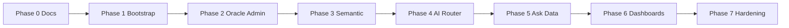

# Smart BI Technical Roadmap

This roadmap orders engineering work from documentation through MVP hardening. It pairs with [User Experience](./02-ux-roadmap.md) milestones and [Solution Architecture](./solution-architecture.md).

## Milestone overview

## Phase 0 - Documentation and Design Gate
- Finalize product, UX, technical, and security documents.
- Obtain stakeholder approval before coding.

## Phase 1 - Platform Bootstrap
- Monorepo with Next.js app and FastAPI service.
- Postgres + Redis via Docker Compose.
- Shared contracts package.
- JWT auth and RBAC.

## Phase 2 - Data Admin Capabilities
- Oracle connection profile management.
- Connectivity test endpoint.
- Schema introspection pipeline for tables, columns, PK/FK.

## Phase 3 - Semantic Layer
- CRUD for:
  - Table descriptions
  - Relationships
  - Dictionary terms
  - Metrics
- Versioning for semantic definitions.

## Phase 4 - AI Orchestration
- Provider abstraction.
- Task-based routing profiles.
- Retry and fallback strategy.
- Latency/cost tracking.

## Phase 5 - Ask Data
- Retrieval of semantic context.
- SQL generation, SQL safety validation, execution.
- Result-grounded narrative response generation.
- Unified response payload for frontend rendering.

## Phase 6 - Dashboard AI
- Generate dashboard spec from chat outputs.
- Save dashboard and versions.
- AI edit with patch + preview + rollback.

## Phase 7 - Hardening
- Unit and integration tests.
- E2E happy paths for 5 user stories.
- Logging and metrics.
- Release runbook.

## Dependencies and critical path

- **Phases 2–3** (Oracle + semantic) block reliable **Phase 5** (context for NL2SQL).
- **Phase 4** (AI router) should be in place before production-grade **Phase 5–6** (multi-model routing and fallbacks).
- **Phase 7** runs in parallel once core flows exist; acceptance scenarios in [06-acceptance-scenarios.md](./06-acceptance-scenarios.md) define exit checks.

## Post-MVP themes (backlog)

- Additional datasources beyond Oracle (with unified semantic abstractions).
- Row-level security and enterprise IAM integration.
- Async long-running queries and notifications.
- Cost dashboards and quota enforcement per team.
- Expanded automated evaluation for SQL quality and dashboard specs.

## Related documents

| Topic | Document |
|-------|----------|
| UX sequencing | [User Experience](./02-ux-roadmap.md) |
| Architecture | [Solution Architecture](./solution-architecture.md) |
| APIs and data | [Technical Design](./04-technical-design.md) |
| Security | [Security Design](./05-security-design.md) |
