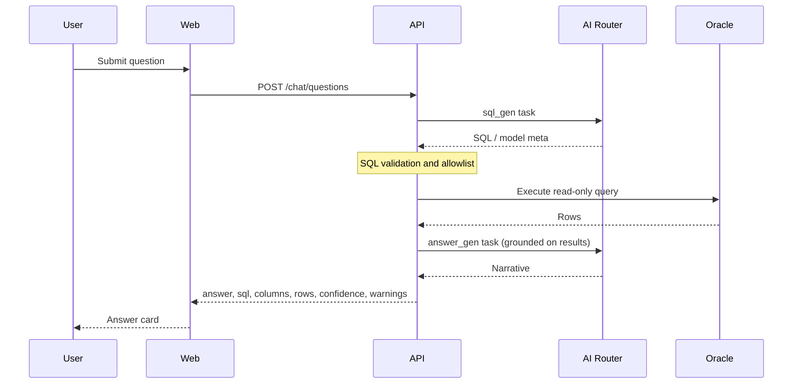

# Smart BI Technical Design

## As-built vs this document

**Status legend:** **[Done]** = matches design direction in code · **[Partial]** = stub or simplified · **[To do]** = not implemented as described

| Topic | Status | Notes |
|-------|--------|--------|
| Monorepo layout (`apps/web`, `apps/api`, `packages/shared`) | **[Done]** | Web uses Next.js App Router (`.js` client components). |
| Docker Compose Postgres + Redis | **[Done]** | Containers available; **API domain data not stored in Postgres yet**. |
| Admin persistence (connections, semantic, AI routing) | **[Partial]** | **JSON files** under `apps/api/data/` with atomic writes; env overrides (see below). |
| Router modules listed below | **[Partial]** | Endpoints implemented; dashboards still **in-memory** in `dashboards` router. |
| Auth (JWT + RBAC enforcement on routes) | **[To do]** | `POST /auth/login` returns dev token + role heuristic; **no** verification middleware on routers. |
| Multi-engine connectivity | **[Partial]** | `app/services/db_engine.py`: **Oracle**, **PostgreSQL**, **MySQL** URLs, ping, introspection, `preview_select` (read-only `LIMIT`). Used by admin test/introspect and chat when `connection_id` set. |
| NL2SQL + SQL safety (AST, allowlist) | **[To do]** | Chat uses **heuristic table pick** + fixed `preview_select`; no generated-SQL policy engine. |
| AI router real providers | **[To do]** | `run_task` returns **simulated** output; profiles drive displayed provider/model. |
| Dashboard persistence | **[Partial]** | In-process lists in `app/routers/dashboards.py` (lost on restart). |

### File-backed admin data (as-built)

| Concern | Default path | Override env var |
|---------|----------------|------------------|
| Datasource connections | `apps/api/data/connections.json` | `SMART_BI_CONNECTIONS_FILE` |
| Semantic bundle (tables, relationships, dictionary, metrics) | `apps/api/data/semantic.json` | `SMART_BI_SEMANTIC_FILE` |
| AI routing profiles per task | `apps/api/data/ai_routing.json` | `SMART_BI_AI_ROUTING_FILE` |

Passwords for connections are stored **in plaintext inside the JSON file** (development convenience only — see [Security Design](./05-security-design.md)).

## Repository layout

| Path | Responsibility |
|------|----------------|
| `apps/web` | Next.js frontend (admin + user workspaces) |
| `apps/api` | FastAPI application (`app.main`), routers under `app/routers/` |
| `packages/shared` | Shared contracts (schemas, DTOs) |
| `docker-compose.yml` | Local Postgres 16 + Redis 7 |

## High-Level Architecture
- `apps/web`: Next.js frontend for admin and users (JavaScript client modules).
- `apps/api`: FastAPI backend for auth, semantic layer, chat, dashboards.
- `packages/shared`: shared schemas and DTO contracts.
- **Postgres** (Compose): available for future app metadata; **not** the active store for connections/semantic/routing today.
- **Business databases**: Oracle, PostgreSQL, or MySQL via SQLAlchemy (`oracledb` / `psycopg` / `pymysql` drivers as configured in requirements).
- **Redis** (Compose): available for future cache/session/job state.

Solution-level diagrams and capability mapping: [Solution Architecture](./solution-architecture.md).

## Service Components (FastAPI)
- Auth service (JWT + RBAC).
- Connection service (Oracle config and validation).
- Schema service (introspection and metadata sync).
- Semantic service (table, relation, dictionary, metric CRUD + versioning).
- AI router service (multi-provider, task-based model profiles).
- Query service (NL2SQL + safety checks + execution).
- Dashboard service (create, edit, versioning).

## API modules (implementation)

Routers registered in `apps/api/app/main.py`:

| Router module | Prefix (typical) | Concern |
|---------------|------------------|---------|
| `auth` | `/auth` | Login / JWT |
| `admin_connections` | `/admin/connections` | Oracle profiles, test, introspect |
| `admin_semantic` | `/admin/semantic` | Tables, relationships, dictionary, metrics |
| `admin_ai_routing` | `/admin/ai-routing` | Catalog (`GET …/catalog`), profiles CRUD, `POST …/validate` |
| `chat` | `/chat` | Ask data (`POST /chat/questions`) — optional `connection_id` for live DB preview |
| `dashboards` | `/dashboards` | CRUD, AI edit, versions |

Health: `GET /health`.

## Ask Data sequence

**Target (full NL2SQL):**

**As-built today:** `sql_gen` / `answer_gen` still produce **simulated** strings for `meta` and `answer`. If `connection_id` is **omitted**, SQL/rows are **demo placeholders**. If `connection_id` is set, the API loads or introspects tables, picks a table (keyword overlap heuristic or first table), runs **`preview_select`** (`SELECT` + `LIMIT` 50) via SQLAlchemy, and returns real `sql` / `columns` / `rows` with a **warning** that NL2SQL is not enabled.

## AI Task Profiles
- `sql_gen`: SQL generation and SQL repair.
- `answer_gen`: user-facing narrative answer.
- `dashboard_gen`: dashboard spec generation and patching.
- `extract_classify`: entity extraction and intent classification.

Each profile includes:
- provider
- model
- temperature
- max_tokens
- timeout_ms
- cost_limit
- fallback_profile

## Data Model (Core)
- `users`
- `roles`
- `datasource_connections`
- `schemas`
- `tables`
- `columns`
- `relationships`
- `dictionary_terms`
- `metrics`
- `semantic_versions`
- `ai_routing_profiles`
- `chat_sessions`
- `chat_messages`
- `query_runs`
- `dashboards`
- `dashboard_versions`

## API Contracts (Core)
- Admin:
  - `GET`/`POST` `/admin/connections`; `PUT` `/admin/connections/{id}`
  - `POST` `/admin/connections/{id}/test` — real DB ping
  - `POST` `/admin/connections/{id}/introspect` — real metadata query; caches result server-side for chat
  - `GET`/`POST`/`PUT` `/admin/semantic/tables|relationships|dictionary|metrics`
  - `GET` `/admin/ai-routing/catalog` — allowlisted providers and models (`app/ai_routing_catalog.py`)
  - `GET`/`POST`/`PUT` `/admin/ai-routing/profiles`; `POST` `/admin/ai-routing/validate`
- User:
  - `POST` `/chat/questions` — body: `{ "question": string, "connection_id"?: number }`
  - `GET`/`POST` `/dashboards`; `GET` `/dashboards/{id}`; `POST` `/dashboards/{id}/ai-edit`; `GET` `/dashboards/{id}/versions`

Connection payloads support `source_type`: `oracle` | `postgresql` | `mysql` (see `ConnectionPayload` in `admin_connections.py`).

## SQL Safety Rules
- Read-only statements only.
- Allowlist schema and tables.
- Enforce row limit defaults.
- Deny dangerous functions or DDL/DML.
- Require parsed SQL AST validation before execution.

## Operational notes

- **Local API**: Python 3.12 or 3.13 recommended; run with `uvicorn app.main:app`.
- **Observability**: HTTP request logging middleware is attached in `main.py`; extend with structured metrics and AI token/cost counters per task profile for production.
- **Evolution**: Replace stubbed or simplified chat/dashboard paths with full NL2SQL + spec validation while keeping response contracts stable for the web client.

**[To do]** items aligned with roadmap: Postgres-backed metadata, credential encryption at rest, NL2SQL + **SQL policy engine** on any generated text, provider SDK integration, durable dashboards, enforced JWT/RBAC, and semantic **versioning**.

**Implemented recently (summary):** SQLAlchemy-based engine layer for three DB kinds; file persistence for admin stores; admin AI catalog; chat **live preview** path; Next.js flows for admin / ask / dashboards; Playwright smoke tests (`apps/web/e2e/app.spec.js`).
