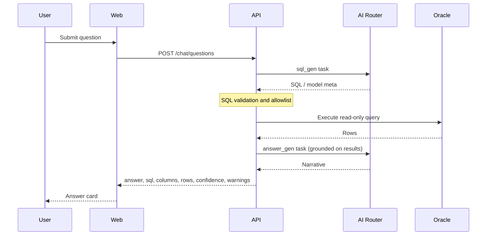

# Smart BI Technical Design

## Repository layout

| Path | Responsibility |
|------|----------------|
| `apps/web` | Next.js frontend (admin + user workspaces) |
| `apps/api` | FastAPI application (`app.main`), routers under `app/routers/` |
| `packages/shared` | Shared contracts (schemas, DTOs) |
| `docker-compose.yml` | Local Postgres 16 + Redis 7 |

## High-Level Architecture
- `apps/web`: Next.js frontend for admin and users.
- `apps/api`: FastAPI backend for auth, semantic layer, chat, dashboards.
- `packages/shared`: shared schemas and DTO contracts.
- Postgres: metadata and application state.
- Oracle: business data source.
- Redis: cache/session/job status.

Solution-level diagrams and capability mapping: [Solution Architecture](./solution-architecture.md).

## Service Components (FastAPI)
- Auth service (JWT + RBAC).
- Connection service (Oracle config and validation).
- Schema service (introspection and metadata sync).
- Semantic service (table, relation, dictionary, metric CRUD + versioning).
- AI router service (multi-provider, task-based model profiles).
- Query service (NL2SQL + safety checks + execution).
- Dashboard service (create, edit, versioning).

## API modules (implementation)

Routers registered in `apps/api/app/main.py`:

| Router module | Prefix (typical) | Concern |
|---------------|------------------|---------|
| `auth` | `/auth` | Login / JWT |
| `admin_connections` | `/admin/connections` | Oracle profiles, test, introspect |
| `admin_semantic` | `/admin/semantic` | Tables, relationships, dictionary, metrics |
| `admin_ai_routing` | `/admin/ai-routing` | Task profiles and validation |
| `chat` | `/chat` | Ask data (`POST /chat/questions`) |
| `dashboards` | `/dashboards` | CRUD, AI edit, versions |

Health: `GET /health`.

## Ask Data sequence (logical)

## AI Task Profiles
- `sql_gen`: SQL generation and SQL repair.
- `answer_gen`: user-facing narrative answer.
- `dashboard_gen`: dashboard spec generation and patching.
- `extract_classify`: entity extraction and intent classification.

Each profile includes:
- provider
- model
- temperature
- max_tokens
- timeout_ms
- cost_limit
- fallback_profile

## Data Model (Core)
- `users`
- `roles`
- `datasource_connections`
- `schemas`
- `tables`
- `columns`
- `relationships`
- `dictionary_terms`
- `metrics`
- `semantic_versions`
- `ai_routing_profiles`
- `chat_sessions`
- `chat_messages`
- `query_runs`
- `dashboards`
- `dashboard_versions`

## API Contracts (Core)
- Admin:
  - `/admin/connections`
  - `/admin/connections/{id}/test`
  - `/admin/connections/{id}/introspect`
  - `/admin/semantic/*`
  - `/admin/ai-routing/profiles`
- User:
  - `/chat/questions`
  - `/dashboards`
  - `/dashboards/{id}/ai-edit`
  - `/dashboards/{id}/versions`

## SQL Safety Rules
- Read-only statements only.
- Allowlist schema and tables.
- Enforce row limit defaults.
- Deny dangerous functions or DDL/DML.
- Require parsed SQL AST validation before execution.

## Operational notes

- **Local API**: Python 3.12 or 3.13 recommended; run with `uvicorn app.main:app`.
- **Observability**: HTTP request logging middleware is attached in `main.py`; extend with structured metrics and AI token/cost counters per task profile for production.
- **Evolution**: Replace stubbed or simplified chat/dashboard paths with full NL2SQL + spec validation while keeping response contracts stable for the web client.
