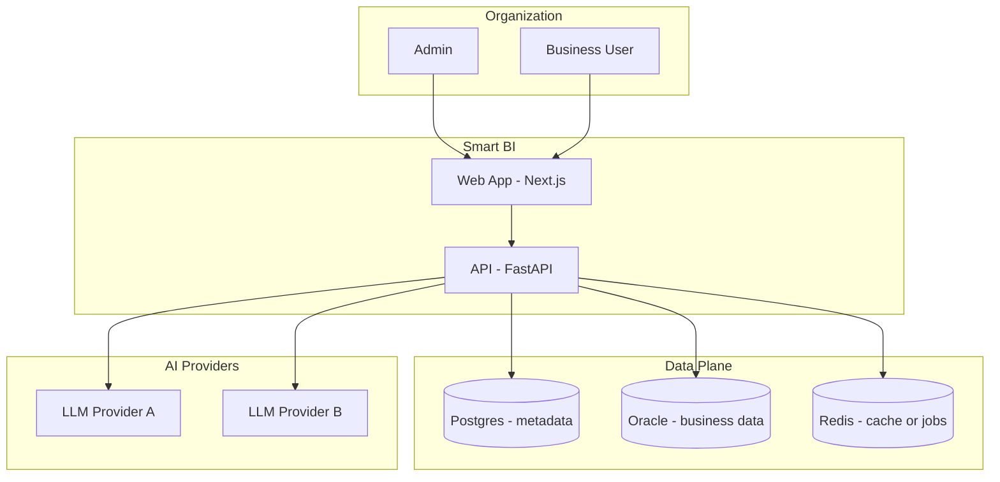
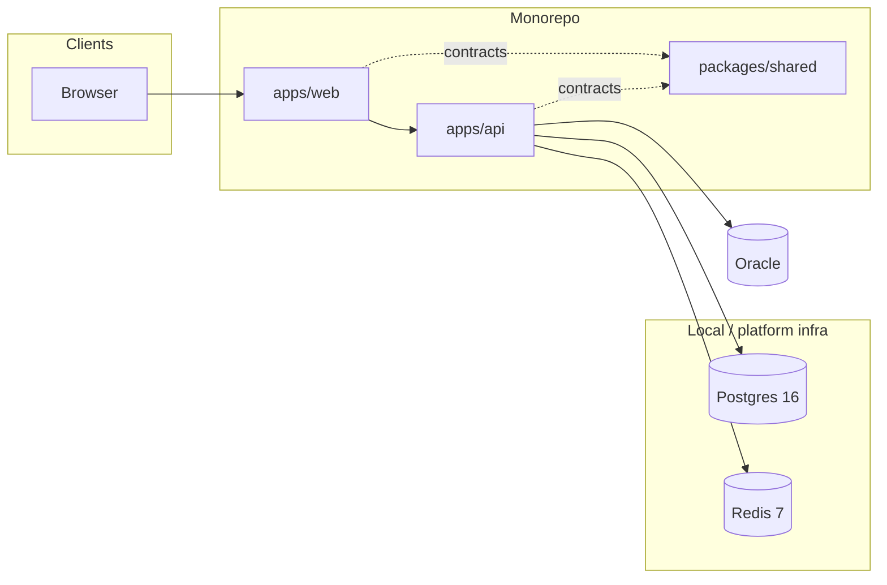

# Smart BI — Solution Architecture

This document describes the solution from an architecture perspective: capabilities, major components, integrations, and how they satisfy MVP goals. Detailed API and data shapes live in [Technical Design](./04-technical-design.md).

## 1. Purpose and scope

Smart BI MVP delivers:

- **Governed access to Oracle** via admin-managed connections and a curated semantic layer.
- **Natural-language analytics** with traceable SQL, tabular results, and narrative answers.
- **AI-assisted dashboards** with versioning and safe iteration.

Out of scope for this view matches [Product Vision and Scope](./01-product-vision-and-scope.md) (e.g. multi-tenant billing, mobile-native apps).

## 2. Capability map

| Capability | Primary consumers | Realized by |
|------------|-------------------|-------------|
| Identity & roles | All users | JWT auth, `admin` / `user` RBAC |
| Datasource lifecycle | Admin | Connection CRUD, test, introspection |
| Semantic governance | Admin | Tables, relationships, dictionary, metrics + versioning |
| Model governance | Admin | AI routing profiles per task |
| Ask data | Business user | NL2SQL pipeline, safety policy, execution, narrative |
| Dashboard lifecycle | Business user | Create, list, detail, AI edit, versions |
| Observability | Platform | Request logging, AI task metadata (extend for full metrics) |

## 3. Context (system landscape)

External actors and systems the solution depends on.

## 4. Container view

Logical deployable units in the MVP codebase.

- **Web**: Server and client UI for admin console, chat workspace, and dashboards; calls API over HTTPS in production.
- **API**: Single service owning auth, metadata, semantic layer, chat orchestration, dashboard services, and AI routing.
- **Shared**: Optional shared types/contracts for alignment between web and API.

## 5. Integration principles

- **Oracle**: Only the API tier holds connection credentials; queries run server-side after SQL validation.
- **LLMs**: Invoked through a **task-based router** (`sql_gen`, `answer_gen`, `dashboard_gen`, `extract_classify`) so models can differ per task with fallback policy.
- **Postgres**: System of record for users, connections, semantic definitions, chat/dashboard artifacts, and AI routing configuration.
- **Redis**: Caching, session, or async job state as the implementation matures.

## 6. Cross-cutting concerns

| Concern | Approach |
|---------|----------|
| Security | See [Security Design](./05-security-design.md): JWT, RBAC, credential protection, SQL allowlist, audit hooks. |
| Reliability | Provider fallbacks for AI tasks; defensive validation before executing SQL. |
| Evolvability | Semantic and dashboard versioning; routing profiles configurable without redeploy (target state). |

## 7. Deployment topology (reference)

Typical production pattern:

- **Web** and **API** as separate processes (or containers) behind TLS-terminating ingress.
- **Postgres** and **Redis** as managed or self-hosted data stores.
- **Oracle** reachable only from API network zone (not from browser).

Local development uses Docker Compose for Postgres and Redis per repository `docker-compose.yml`.

## 8. Document map

| Document | Focus |
|----------|--------|
| [User Experience](./02-ux-roadmap.md) | Journeys, IA, UX milestones |
| [Technical Roadmap](./03-technical-roadmap.md) | Delivery phases |
| [Technical Design](./04-technical-design.md) | Components, data model, APIs |
| [Security Design](./05-security-design.md) | Threats and controls |
| [Acceptance Scenarios](./06-acceptance-scenarios.md) | Story-level verification |
